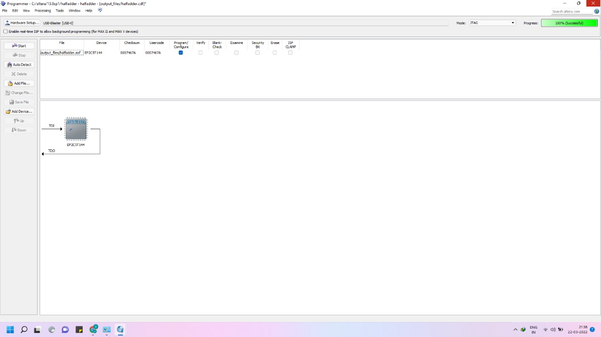

# Experiment-10-programming-logic-device-s-FPGA-BOARDS-
### AIM: To understand the standard procedure to interface an FPGA board and flashing method using usb blaster 
### HARDWARE REQUIRED:  – PC, Cyclone II , USB flasher
### SOFTWARE REQUIRED:   Quartus prime
### THEORY:
```
Developed By:P.Siva Naga Nithin.
Reg.No:212221240037.
```
### Procedure 

Start the Quartus II Programmer.

Click Add File and select the path to the desired .sof.

Turn on the Program/Configure option for the added file.

Click Start to download the selected file to the FPGA. Configuration is complete when the progress bar reaches 100%.


### Output:





### RESULTS 
Therefore the standard procedure to interface an FPGA board and flashing method using usb blaster are understood.
